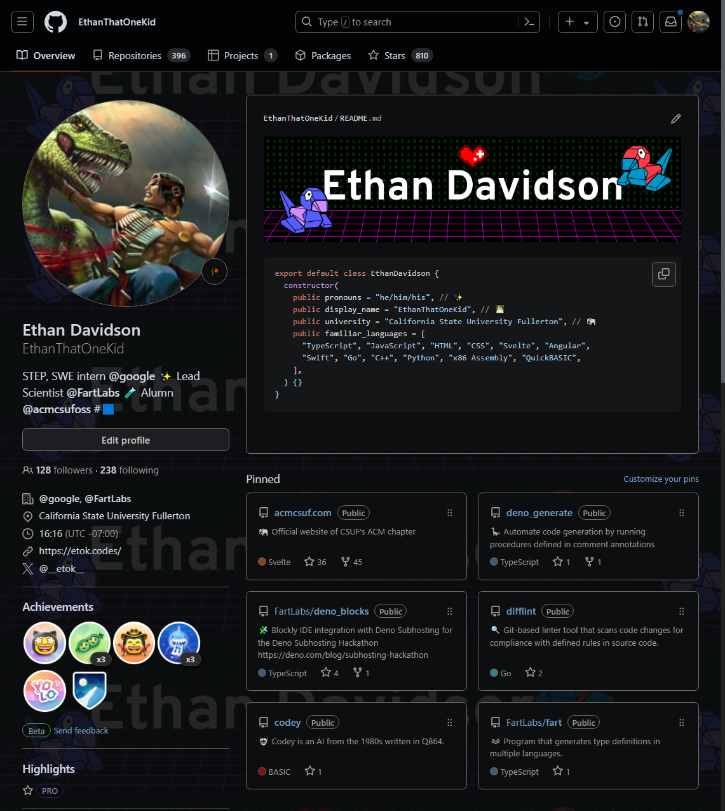
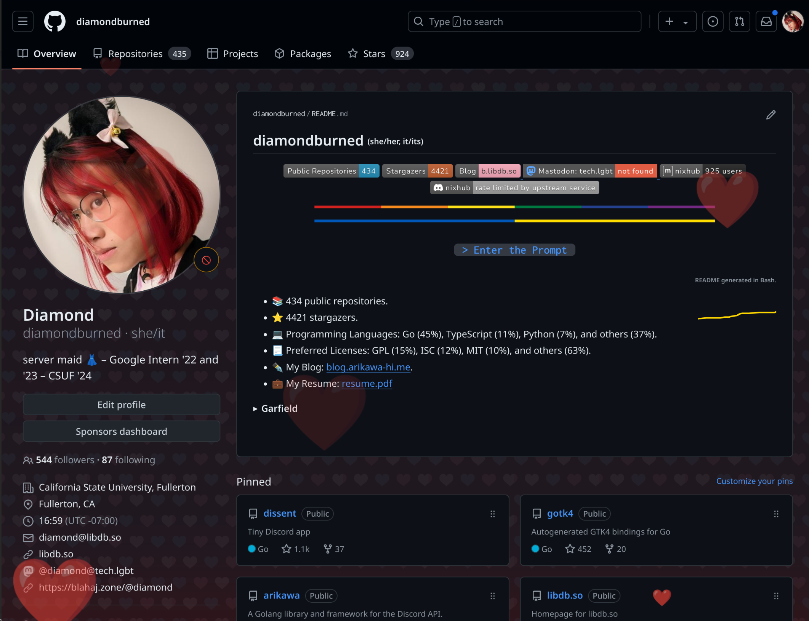

# CSS Injection

## Archive

Archived CSS injection vulnerability: <https://ethanthatonekid.github.io/css-injection>

This repository contains an archived version of my profile page with the CSS injection vulnerability. The vulnerability was fixed by GitHub on 2024-06-08.

## Vulnerability

An attacker could have exploited a weakness in GitHub profiles to inject malicious code. This vulnerability existed in the math tags (\`\`\`math) within a user's README file. By injecting CSS code, an attacker could have potentially created phishing attacks or displayed other harmful content on the profile page. Fortunately, GitHub addressed this issue swiftly before it could be widely misused.

## Showcase

For a brief period, this vulnerability sparked a wave of creativity among some users. By responsibly exploiting the math tags, they were able to design unique and eye-catching customizations for their profiles. This brought back a sense of nostalgia for the bygone era of extensive customization options, reminiscent of Myspace profiles. While these modifications were impressive and demonstrated the vulnerability's potential, it's important to remember the risks associated with such exploits. Thankfully, GitHub patched the issue before it could be used maliciously.

### EthanThatOneKid

### diamondburned

## References

- <https://x.com/cloud11665/status/1799136093071163396>
- <https://news.ycombinator.com/item?id=40615653>
- <https://tech.lgbt/@diamond/112578111474350660>

---

Curated with 💖 by [**@EthanThatOneKid**](https://github.com/EthanThatOneKid)
